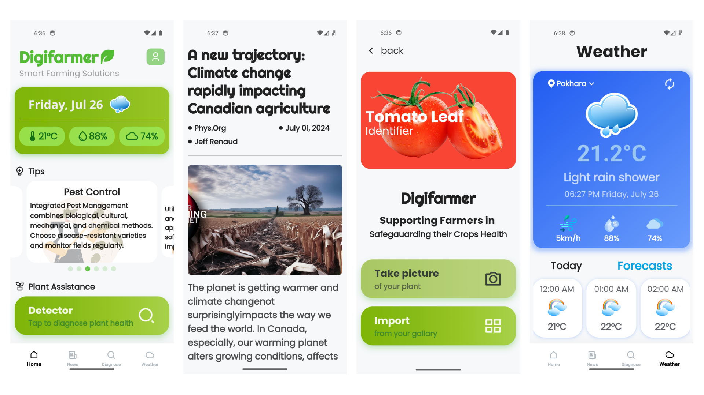

<p align="center">
  
</p>

<br/>

<h1 align="center"> 
  Digifarmer
</h1> 

<br/>

## 🐦 Introduction

`Digifarmer` is a comprehensive Flutter-based mobile application designed to assist farmers and agriculturists by providing vital information and services. It integrates various functionalities such as disease detection, plant health diagnostics, weather forecasting, and agriculture-related news updates. This tool aims to enhance decision-making, improve crop management, and increase productivity. 


## ⭐ Features

Disease Detection: Identify and diagnose plant diseases through image analysis.
Plant Health Diagnostics: Monitor and assess the overall health of plants using various indicators.
Weather Forecasting: Get accurate and timely weather forecasts to plan agricultural activities.
Agriculture News: Stay updated with the latest news and trends in agriculture.


## 🛠️ Development environment

### 🛠️ Basic environment

Windows:

[√] Flutter (Channel stable, 3.22.2, on Microsoft Windows,linux)
<br>
[√] Android toolchain -develop for Android devices (Android SDK version 34.0.0)<br>
[√] Visual Studio -develop Windows apps (Visual Studio Community 2022 17.9.6)<br>
[√] Android Studio (version 2023.3)<br>
[√] IntelliJ IDEA Ultimate Edition (version 2024.1)<br>
[√] VS Code (version 1.90.0)


MacOS:   

[✓] Flutter (Channel stable, 3.22.2, on macOS 14.4.1 23E224 darwin-x64, locale zh-Hans-CN)<br>
[✓] Android toolchain -develop for Android devices (Android SDK version 34.0.0)<br>
[✓] Xcode -develop for iOS and macOS (Xcode 15.4)<br>
[✓] Android Studio (version 2023.3)<br>
[✓] VS Code (version 1.89.1)


## 📖 Setup and Run the App

### Prerequisites

- Ensure you have Flutter installed. Follow the instructions [here](https://flutter.dev/docs/get-started/install).
- Install Android Studio for mobile development.
- Install Visual Studio Code or any other preferred IDE.

### Setup

1. **Clone the repository**:
    ```sh
   git clone  https://github.com/ArunChapagain/digifarmer.git
    cd digifarmer
    ```

2. **Install dependencies**:
    ```sh
    flutter pub get
    ```

3. **Set up your development environment**:

    - For Android: Ensure you have an Android emulator set up or a physical device connected.<br>
    - For iOS: Ensure you have an iOS simulator set up or a physical device connected.

## Running the App

1. **Run on Android**:
    ```sh
    flutter run --debug // for debug mode
    flutter run --release // for release mode
    ```

2. **Run on iOS**:
    ```sh
    flutter run
    ```

## 🌏 Related websites
> Flutter official website: [https://flutter.dev/](https://flutter.dev/)
> Packages (original site): [https://pub.dev/](https://pub.dev/)


